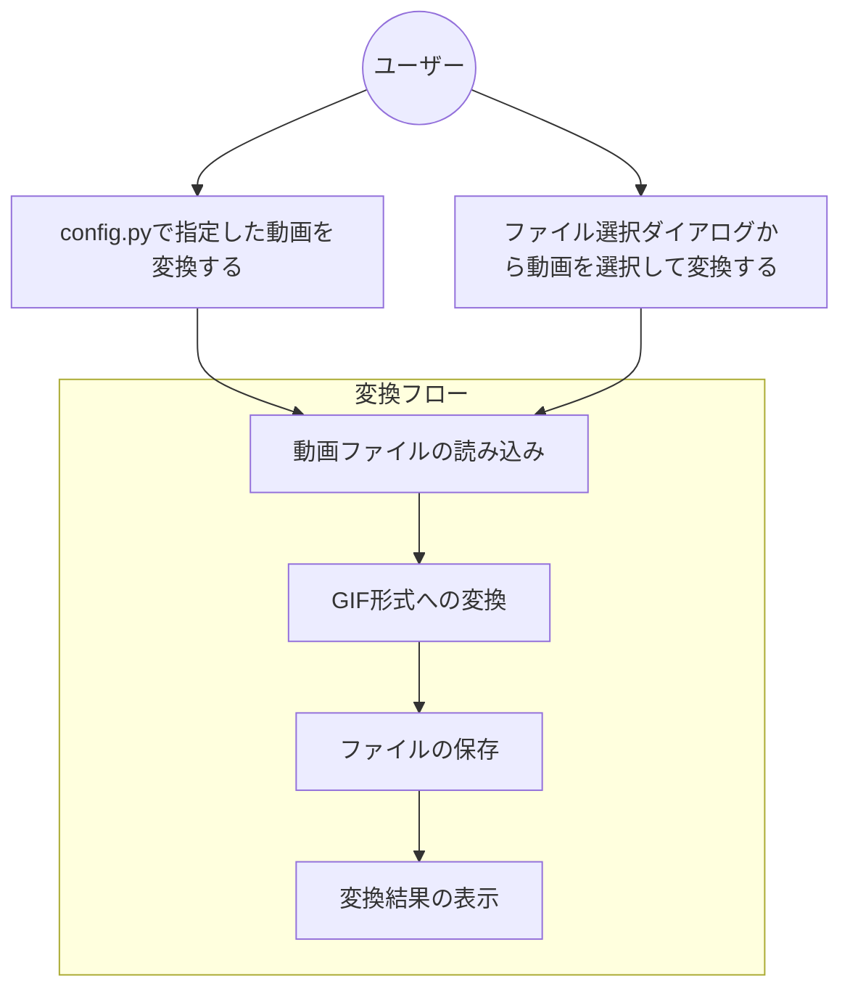
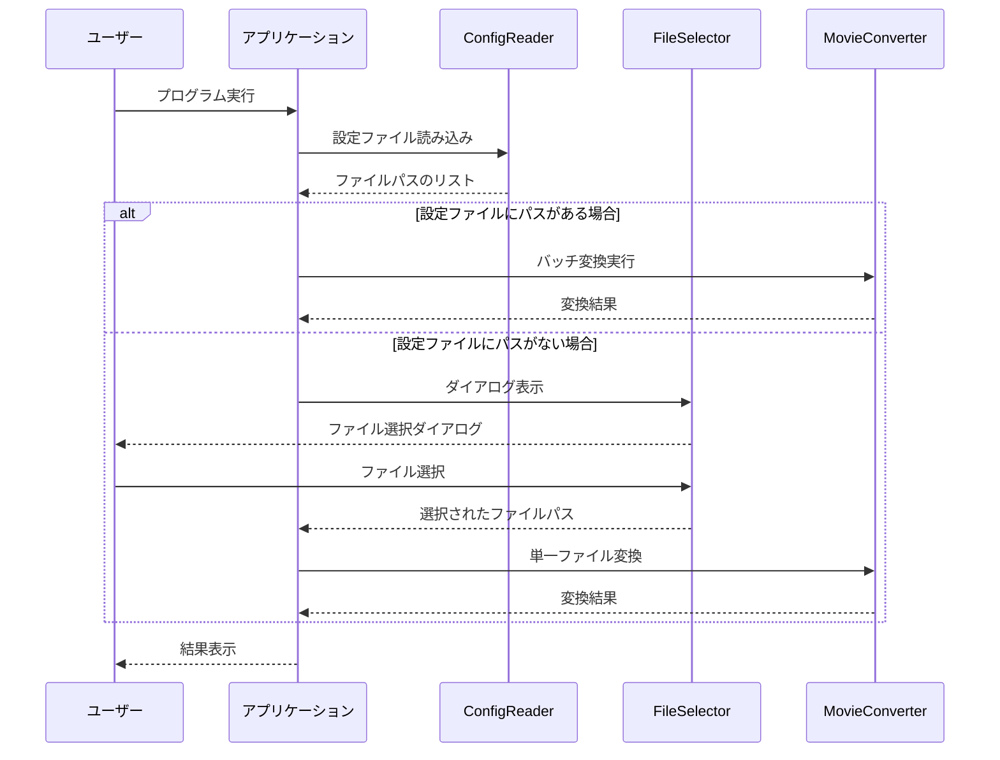
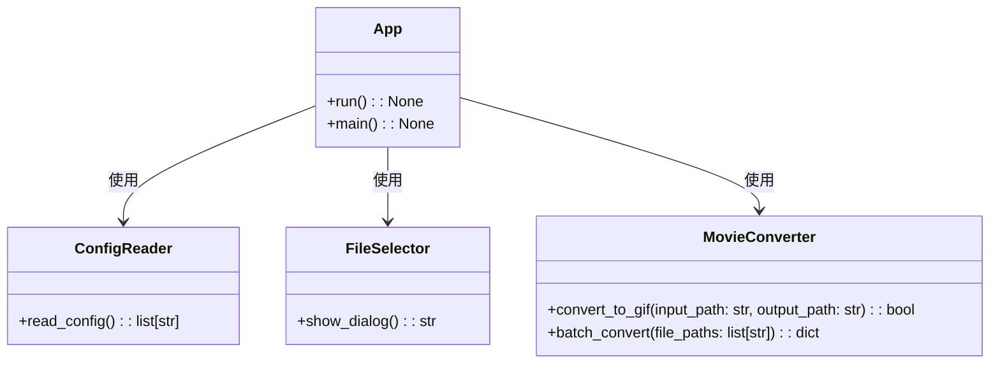

# Issue`1`の仕様書

## 1. 変更履歴
- 2025/5/16: 初版作成

## 1. 目次
- [1. 目次](#1-目次)
- [2. 用語](#2-用語)
- [3. 依頼内容](#3-依頼内容)
- [4. 機能要件/非機能要件](#4-機能要件非機能要件)
  - [4.1. 機能要件](#41-機能要件)
  - [4.2. 非機能要件](#42-非機能要件)
- [5. 使用ツール/ライブラリ](#5-使用ツールライブラリ)
- [6. クラス設計](#6-クラス設計)
  - [6.1. `Xxx`クラス(新規)](#61-xxxクラス新規)
- [7. UML](#7-uml)
  - [ユースケース図](#ユースケース図)
  - [7.1. シーケンス図](#71-シーケンス図)
  - [7.2. クラス図](#72-クラス図)
- [8. タスク](#8-タスク)
  - [8.1. (補足)本セクションの説明](#81-補足本セクションの説明)

## 2. 用語
-  プロジェクト名称: mov2gif

## 3. 依頼内容
- issue番号: 1
- タイトル: movファイルをgifに変換する機能の実装
- 内容: 
  - movファイルパスをconfig.pyに配列で記載すると、一気にgifに変換してくれる
  - movファイルパスがconfig.pyに記載されていない場合は、tkinterでファイル選択ダイアログを表示し、選択したmovファイルをgifに変換する

## 4. 機能要件/非機能要件
### 4.1. 機能要件
- config.pyに記載されたmovファイルパスを読み込み、複数のmovファイルを一括でgifに変換できること
- config.pyに記載がない場合は、tkinterを使用してファイル選択ダイアログを表示できること
- ユーザーがダイアログから選択したmovファイルをgifに変換できること
- 変換したgifファイルは元のファイル名と同じ名前（拡張子のみ変更）で保存すること
- 変換処理の進行状況をコンソールに表示すること
### 4.2. 非機能要件
- 利用可能な環境：macOS、Windows、Linux
- Python 3.8以上で動作すること
- 必要なライブラリはrequirements.txtに記載すること

## 5. 使用ツール/ライブラリ
- Python標準ライブラリ
  - tkinter: GUIダイアログ表示用
  - os, sys: ファイルパス操作
- サードパーティライブラリ
  - moviepy: 動画処理、mov→gif変換
  - tqdm（オプション）: 進行状況表示

## 6. クラス設計
### 6.1. `ConfigReader`クラス(新規)
#### 格納場所
- `src/config_reader.py`
#### メソッド: 
- `read_config() -> list[str]`
  - 説明: config.pyファイルから動画ファイルパスのリストを読み込む
  - 戻り値: 動画ファイルパスのリスト

#### テストケース
- 正常系:
  - 設定ファイルに動画パスが記載されている場合
    - 入力: 正常なconfig.py
    - 期待値: 動画パスのリスト
- 異常系:
  - 設定ファイルが存在しない場合
    - 入力: 存在しないconfig.py
    - 期待値: 空のリスト
  - 設定ファイルの形式が不正な場合
    - 入力: 不正なフォーマットのconfig.py
    - 期待値: 適切なエラーメッセージ

### 6.2. `FileSelector`クラス(新規)
#### 格納場所
- `src/file_selector.py`
#### メソッド: 
- `show_dialog() -> str`
  - 説明: tkinterを使用してファイル選択ダイアログを表示し、選択されたファイルのパスを返す
  - 戻り値: 選択されたファイルパス（選択がキャンセルされた場合は空文字列）

#### テストケース
- 正常系:
  - ユーザーがファイルを選択した場合
    - 入力: ユーザー操作（ファイル選択）
    - 期待値: 選択されたファイルのパス
- 異常系:
  - ユーザーが選択をキャンセルした場合
    - 入力: ユーザー操作（キャンセル）
    - 期待値: 空文字列

### 6.3. `MovieConverter`クラス(新規)
#### 格納場所
- `src/movie_converter.py`
#### メソッド: 
- `convert_to_gif(input_path: str, output_path: str = None) -> bool`
  - 説明: movファイルをgifに変換する
  - 引数:
    - input_path: 入力movファイルのパス
    - output_path: 出力gifファイルのパス（省略時は入力ファイルと同じディレクトリに同名でgif拡張子）
  - 戻り値: 変換成功時はTrue、失敗時はFalse
- `batch_convert(file_paths: list[str]) -> dict`
  - 説明: 複数のmovファイルを一括でgifに変換する
  - 引数:
    - file_paths: 変換対象のmovファイルパスのリスト
  - 戻り値: 変換結果の辞書 {ファイルパス: 成功/失敗}

#### テストケース
- 正常系:
  - 単一ファイル変換
    - 入力: 有効なmovファイルパス
    - 期待値: 変換成功、True返却
  - 複数ファイル変換
    - 入力: 有効なmovファイルパスのリスト
    - 期待値: すべてのファイルが変換され、成功結果の辞書を返却
- 異常系:
  - 無効なファイルパス
    - 入力: 存在しないファイルパス
    - 期待値: 変換失敗、False返却
  - サポートされていないファイル形式
    - 入力: mov以外のファイル
    - 期待値: 変換失敗、適切なエラーメッセージ

### 6.4. `App`クラス(新規)
#### 格納場所
- `src/app.py`
#### メソッド: 
- `run() -> None`
  - 説明: アプリケーションのメイン実行ロジック
  - 動作:
    1. ConfigReaderを使用して設定からファイルパスを読み込む
    2. パスが取得できなかった場合、FileSelectorを使用してユーザーにファイル選択を促す
    3. MovieConverterを使用してファイル変換を実行
    4. 結果を表示
- `main() -> None`
  - 説明: プログラムのエントリーポイント

#### テストケース
- 正常系:
  - config.pyにパスが設定されている場合
    - 入力: 有効なconfig.py設定
    - 期待値: バッチ変換が実行される
  - config.pyにパスがない場合
    - 入力: パス設定のないconfig.py
    - 期待値: ファイル選択ダイアログが表示される

## 7. UML
### ユースケース図

### 7.1. シーケンス図

### 7.2. クラス図

## 8. タスク
- 合計工数: 5h
- [ ] プロジェクト構成とセットアップ(0.5h)
  - [ ] ディレクトリ構造の作成(0.2h)
    - src ディレクトリ作成
    - requirements.txt 作成
  - [ ] 必要なライブラリのインストール(0.3h)
    - moviepy、tkinter等のインストール
    
- [ ] ConfigReaderクラスの実装(1h)
  - [ ] read_config メソッドの実装(0.5h)
    - config.pyファイルを読み込む機能
    - 動画ファイルパスのリストを返す機能
  - [ ] テストケースの実装(0.5h)
    - 正常系・異常系テスト

- [ ] FileSelectorクラスの実装(1h)
  - [ ] show_dialog メソッドの実装(0.5h)
    - tkinterを使ったファイル選択ダイアログ表示
    - 選択されたファイルパスの返却
  - [ ] テストケースの実装(0.5h)
    - 正常系・異常系テスト

- [ ] MovieConverterクラスの実装(1.5h)
  - [ ] convert_to_gif メソッドの実装(0.5h)
    - movファイルを読み込む機能
    - gifへの変換機能
    - 出力ファイルの保存機能
  - [ ] batch_convert メソッドの実装(0.5h)
    - 複数ファイルを一括変換する機能
    - 変換結果のレポート機能
  - [ ] テストケースの実装(0.5h)
    - 正常系・異常系テスト

- [ ] Appクラスの実装(1h)
  - [ ] run メソッドの実装(0.5h)
    - アプリケーションのメインロジック実装
    - 各クラスの連携処理
  - [ ] main メソッドの実装(0.2h)
    - エントリーポイント実装
  - [ ] テストケースの実装(0.3h)
    - 正常系・異常系テスト

### 8.1. (補足)本セクションの説明
- 各タスクには、以下の内容を記載します。
  - タスクの内容
  - タスクの人時工数(例: 1h)
    - 人時工数は、あくまで目安であり、推測されるコーディング量などから算出してください。 
- メインタスクには、主に以下の内容を記載します。
  - 依頼内容の要件を大まかに分解したもの
  - 分解はこの段階では細かくしすぎないこと
  - (例: -[ ] 〇〇機能の実装(1h))
- サブタスクには、主に以下の内容を記載します。
  - メインタスクをより細かく分解したもの
  - クラスやメソッド実装のレベルまで分解する
  - (例: -[ ] 〇〇クラスの実装(1h))
- 実装内容には、自由形式でクラス内部のメンバやメソッドについて記載します。
  - (例: -[ ] 〇〇メソッドの実装(1h))
    - xxをおこなうxxメソッドを実装する
    - メンバにはxxやxxを実装する
    - xxインターフェースを継承する
- 合計工数は、メインタスクの合計工数を記載します。

